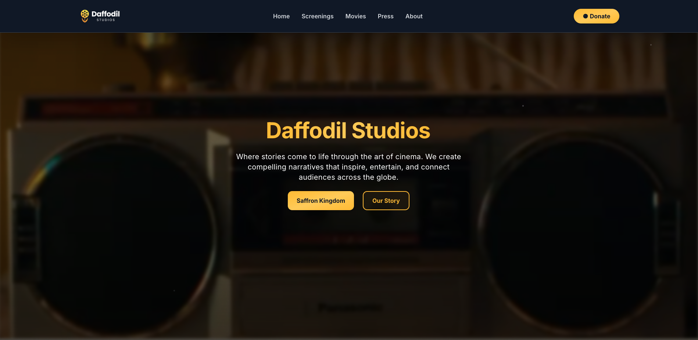
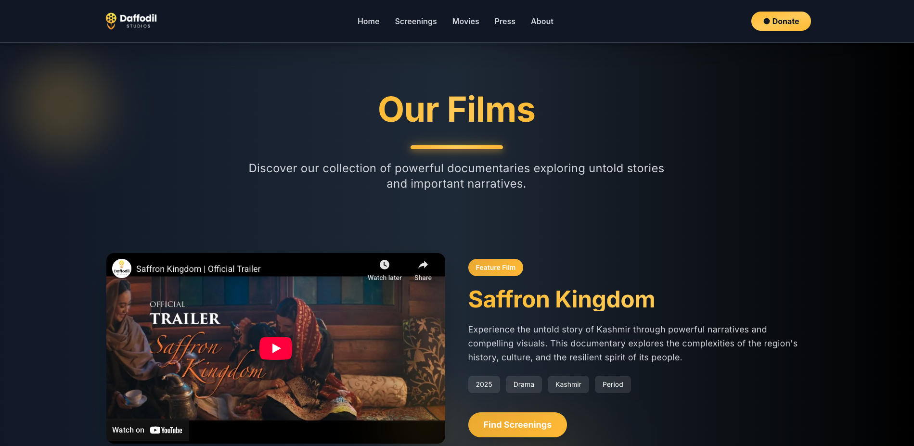
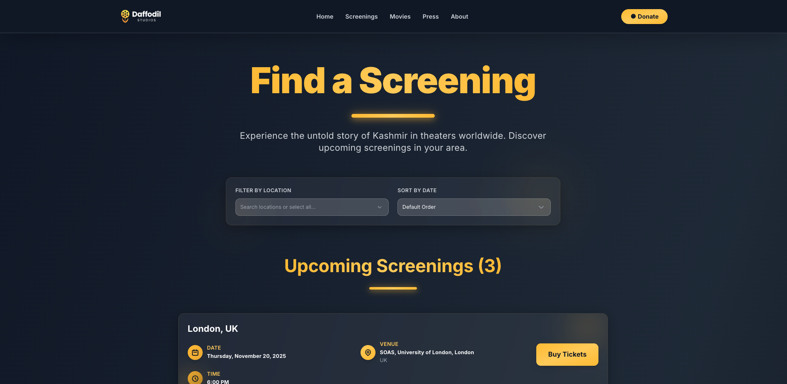
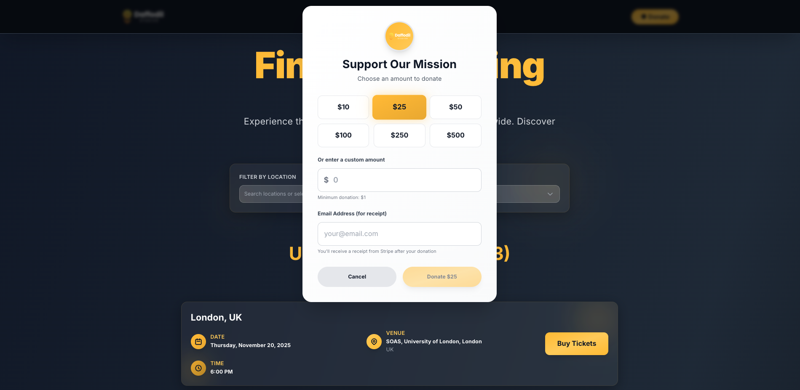

# Daffodil Studios

Official website for Daffodil Studios - Documentary filmmakers bringing untold stories to audiences worldwide.

**Live Site:** [https://www.daffodilstudios.org/](https://www.daffodilstudios.org/)

## Demo






## About

Daffodil Studios creates powerful documentaries that shed light on important narratives, featuring films like "Saffron Kingdom" which explores the untold story of Kashmir.

## Quick Start

### Development

```bash
# Install dependencies
npm install

# Start development server
npm run dev

# Open http://localhost:3000
```

### Environment Setup

Create a `.env` file with your API keys:
```env
# Email API
NUXT_RESEND_API_KEY=your_resend_api_key_here

# Stripe Payment Keys
NUXT_STRIPE_SECRET_KEY=sk_test_your_key_here
NUXT_PUBLIC_STRIPE_PUBLISHABLE_KEY=pk_test_your_key_here
```

Get API keys from:
- Resend: [resend.com](https://resend.com)
- Stripe: [dashboard.stripe.com/apikeys](https://dashboard.stripe.com/apikeys)

See [STRIPE_SETUP.md](./STRIPE_SETUP.md) for detailed Stripe integration guide.

## Deployment

See [SIMPLE_DEPLOYMENT.md](./SIMPLE_DEPLOYMENT.md) for complete deployment instructions.

**Summary:**
1. Push to GitHub
2. Connect to Vercel (automatically deploys)
3. Add `NUXT_RESEND_API_KEY` environment variable in Vercel
4. Done

## Tech Stack

- **Framework**: Nuxt 3
- **Styling**: Tailwind CSS
- **Email**: Resend API
- **Payments**: Stripe
- **Hosting**: Vercel (recommended)
- **Videos**: Cloudinary (recommended)

## Project Structure

```
daffodil-studios/
├── pages/           # Route pages (index, screenings, movies, press, about)
├── components/      # Reusable Vue components
├── assets/         # Images, styles, videos
├── server/         # API routes (contact form)
├── public/         # Static files
└── layouts/        # Layout templates
```

## Features

- Film screenings with location and country filtering
- Stripe payment integration for ticket purchases
- Donation button with Stripe
- Movies showcase with zigzag layout
- Press and media coverage (22 articles)
- Contact form with email integration
- Responsive design
- SEO optimized

## Contact

Email: contact@daffodilstudios.org

## License

© 2025 Daffodil Studios. All rights reserved.
